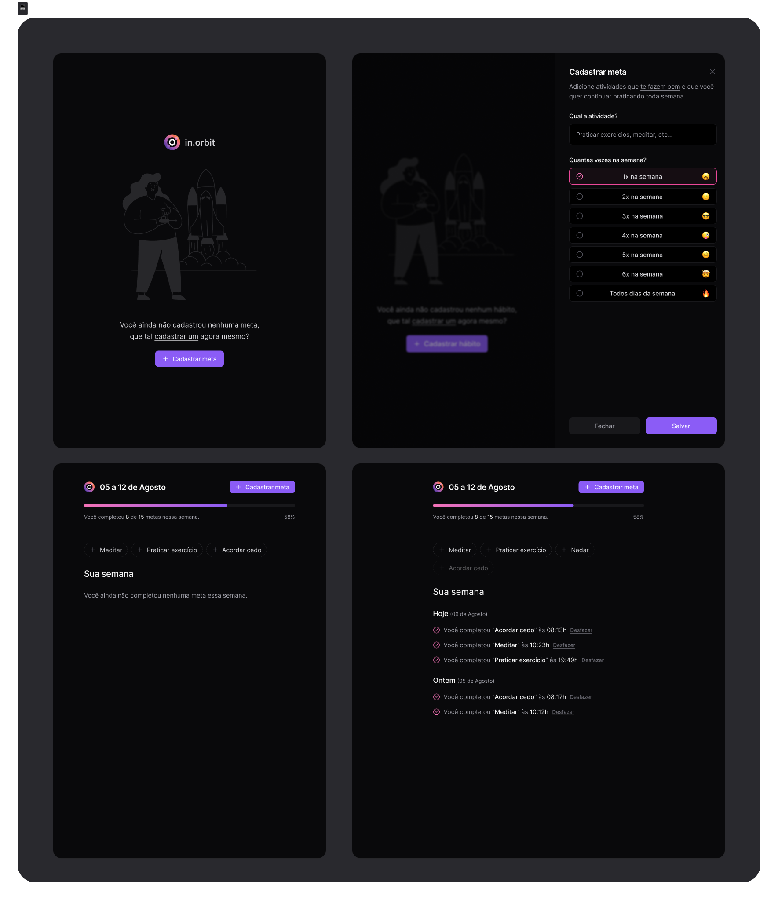

<h1 align="center"> Inorbit </h1>

  

 Project developed during the NLW Pocket JS, by Rocketseat.

## Development tools

This project was made using:

- Nodejs
- Reactjs
- JavaScript
- Git e Github
- Figma

And following the NLW videos availabre in Rockeatseat.

## How to run

On the server side (three diferent terminals):
- docker-compose up (start the db)
- npm run dev (to start the server)
- npx drizzle-kit migrate (to migrate the tables)
- npm run seed (to populate the database with some exemples)

In the web side:
- npm run dev

---

 Made with ♡ by Joana M 

